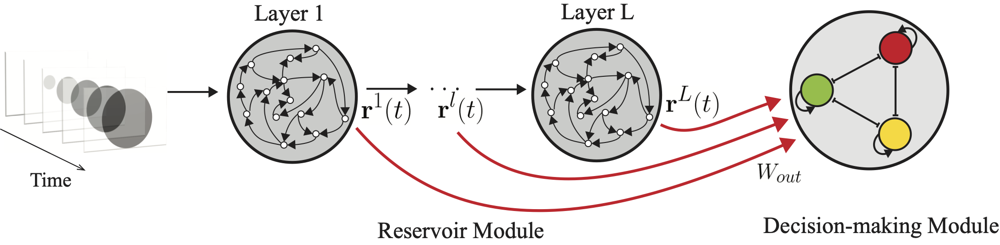
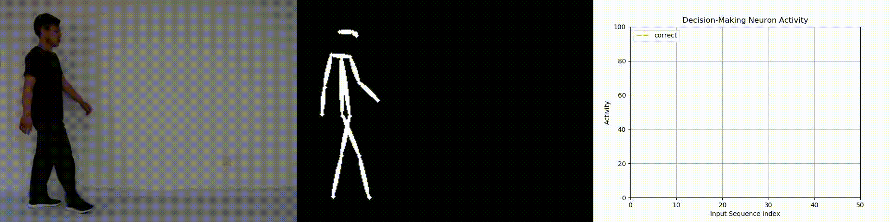
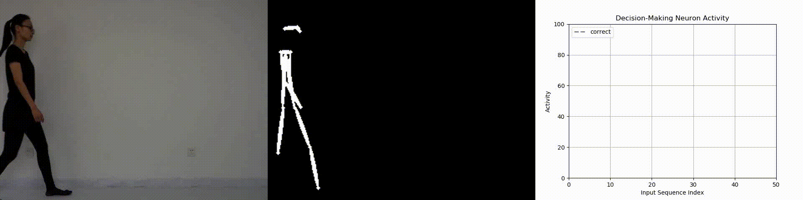

# A Spatiotemporal Pattern Recognition Algorithm Inspired by the Brain
## Motivation
The brain is the most intelligent system we currently have access to. It’s only natural for people to look into the nervous system for inspirations on how to build an artificial intelligence system. We noticed in both auditory pathway and (subcortical) visual pathway, information is processed by a canonical neural algorithm that can be modeled via a reservoir network followed by a decision-making circuitry. Specifically, in the auditory pathway, this could be mediated by spiral ganglion cells [1,2] and octopus cells [3], whereas in the subcortical visual pathway, this might be realized by the retina and wide field vertical cells in the superior colliculus [4]. Spiral ganglion cells and retina could act as a reservoir network that projects input patterns into a high dimensional space allowing for better linear separability [5,6]. Octopus cells and wide field vertical cells are characterized by their large dendritic trees that can sample and integrate information from a large receptive fields [3,4].
This repo contains the bio-inspired algorithm demo that can learn to differentiate different spatiotemporal patterns (such as video or voice commands).

## Model
Our model consists of a reservoir network and a decision-making circuitry.
<div align="center">
    
</div>


## Usage
1) To test this demo on our self-collected gait skeleton dataset, kindly download the dataset from [here](https://drive.google.com/drive/folders/1lbGD18Psb5jszMNHmzBc7bwl_hZkztG-).

2) Clone this repo
```
git clone https://github.com/charlielam0615/subcortical.git
cd subcortical
```

3) To test this demo on different numbers of subjects **without** running visualization procedure (you can use this demo to test on N=5,10,15 number of subjects), run
```
python main.py -v /path/to/dataset/ N
```
This will evaluate the algorithm performance on N selected subjects, with N=5, 10, or 15.

Or to test this demo on different numbers of subjects along with visualization procedure (you can use this demo to test on N=5,10,15 number of subjects), run
```
python main.py \
	--do_vis \
	--vis_path /path/to/dataset/ \
	--vis_result_path /path/to/result/location/ \
	--verbose \
	/path/to/dataset/ N
```
This will evaluate the algorithm performance on N selected subjects, with N=5, 10, or 15. Meanwhile, this will visualize the neural activity of decision-making circuitry with regards to input gait sequence.

<div align="center">
    
</div>
<div align="center">
    
</div>


## Reference
[1] Kiang, N. Y., Rho, J. M., Northrop, C. C., Liberman, M. C., & Ryugo, D. K. (1982). Hair-cell innervation by spiral ganglion cells in adult cats. *Science*, *217*(4555), 175-177.

[2] Spoendlin, H. (1974). Neuroanatomy of the cochlea. In *Facts and models in hearing*(pp. 18-32). Springer, Berlin, Heidelberg.

[3] Levy, K. L. (1997). The transformation of acoustic information by cochlear nucleus octopus cells: A modeling study.

[4] May, P. J. (2006). The mammalian superior colliculus: laminar structure and connections. *Progress in brain research*, *151*, 321-378.

[5] Cayco-Gajic, N. A., & Silver, R. A. (2019). Re-evaluating circuit mechanisms underlying pattern separation. *Neuron*, *101*(4), 584-602.

[6] Lukoševičius, M., & Jaeger, H. (2009). Reservoir computing approaches to recurrent neural network training. *Computer Science Review*, *3*(3), 127-149.
